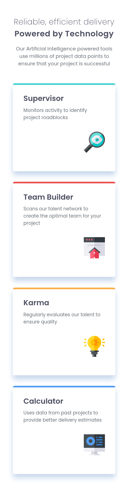

# Frontend Mentor - Four card feature section solution

This is a solution to the [Four card feature section challenge on Frontend Mentor](https://www.frontendmentor.io/challenges/four-card-feature-section-weK1eFYK). Build it using css flexbox, html.

## Table of contents

- [Overview](#overview)
  - [The challenge](#the-challenge)
  - [Screenshot](#screenshot)
  - [Links](#links)
- [My process](#my-process)
  - [Built with](#built-with)
  - [What I learned](#what-i-learned)
  - [Continued development](#continued-development)
- [Author](#author)

## Overview

### The challenge

Users should be able to:

- View the optimal layout for the site depending on their device's screen size

### Screenshot

### Links

- Solution URL: [hosted on github](https://github.com/r-yadav01/fm-four-card-feature-section)
- Live Site URL: [click here](https://r-yadav01.github.io/fm-four-card-feature-section)

## My process

### Built with

- Semantic HTML5 markup
- CSS custom properties
- Flexbox
- Mobile-first workflow

### What I learned

- Nothing new, but was a good refresher for css flexbox.

### Continued development

- I would like to experiment with `width` and `max-width` on `` html-tag.

## Author

- Frontend Mentor - [@r-yadav01](https://www.frontendmentor.io/profile/r-yadav01)
- Twitter - [@r_yadav01](https://x.com/r_yadav01)
- GitHub - [r-yadav01](https://github.com/r-yadav01)
